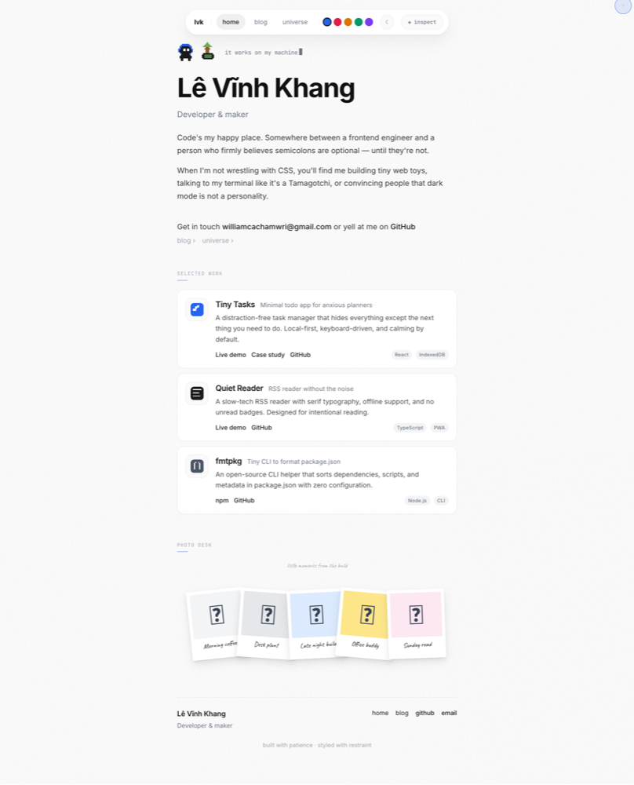

<p align="center">
  <a href="https://wica.info">
    <strong style="font-size: 2.4rem; letter-spacing: -0.04em;">wica</strong>
  </a>
  <br>
  <em>a personal portfolio &mdash; minimalist, monochrome, alive</em>
</p>

<p align="center">
  <a href="https://wica.info"></a>
  <a href="https://vite.dev"></a>
  <a href="https://react.dev"></a>
  <a href="https://www.typescriptlang.org"></a>
  <a href="https://tailwindcss.com"></a>
  <a href="https://www.framer.com/motion"></a>
  <a href="https://mdxjs.com"></a>
  <a href="https://katex.org"></a>
</p>

<p align="center">
  <a href="LICENSE">MIT</a>
  &middot;
  <a href="https://github.com/williamcachamwri/wica">source</a>
  &middot;
  <a href="https://wica.info/feed.xml">rss</a>
</p>

<p align="center">
  
</p>

<br>

---

## overview

**wica** is a single-page portfolio built with an obsessive attention to detail. Every pixel, transition, and interaction is intentional. The design is monochrome with a single accent color — minimalism that does not feel cold.

It is deployed on **Cloudflare Pages** and uses **Cloudflare Functions** for server-side integrations (Spotify, GitHub, Cloudflare Analytics).

### live URL

→ [https://wica.info](https://wica.info)

### what makes it different

- **Dark / light theme** — toggled via an expanding-circle CSS pseudo-element overlay. The animation originates from the toggle button position. No JavaScript-driven clipping. Just `box-shadow: 0 0 0 9999px` and a `cubic-bezier` curve.
- **Custom accent color** — five carefully chosen hues (Blue, Rose, Amber, Emerald, Violet). Persisted to `localStorage`. Every accent reference in the stylesheet is a `var(--accent)` call.
- **Custom cursor** — a `requestAnimationFrame`-driven dot with a trailing glassmorphism ring. Click ripples. Hidden on touch devices via `pointer: coarse` media query. Switches to `crosshair` over interactive chart regions.
- **Floating navbar** — glassmorphism panel with accent picker, theme toggle, and inspector toggle. ArrowUp hides it. ArrowDown shows it. Escape dismisses the inspector.
- **Element inspector** — an overlay that calls `document.elementFromPoint` on hover, highlights the element with a blue outline, and displays its tag, classes, and dimensions in a tooltip. Click logs the full element to console.
- **Curtain loader** — two black panels split vertically with a center-line glow. Gated by `sessionStorage` — shown once per session.
- **Toast notification system** — dispatched via a custom `window` event. No context provider. The `showToast()` function creates a `CustomEvent` that the `ToastContainer` listens for.
- **Code-block copy button** — injected into `<pre>` elements via `useEffect`. Shows a green checkmark for 1.8 seconds after copy.
- **Build-time OG images + RSS** — `npm run build` generates OpenGraph images for every page and post, plus an RSS feed at `/feed.xml`.

<br>

---

## pages

### home

The entry point. A loader gates the experience, then the page fades in through staggered section reveals.

- **Hero** — pixel-art sprite frame, gradient name title with a hover-sweep animation, a `CyclingTypewriter` that rotates through developer-culture phrases, a playful bio, and four contact links (GitHub, email, blog, GitHub profile).
- **GitHub Activity** — contribution heatmap for the last year, fetched via the GitHub GraphQL API. Includes month labels, a legend, and a styled hover tooltip.
- **Projects** — three featured projects (`Tiny Tasks`, `Quiet Reader`, `fmtpkg`), each rendered as a `ProjectCard` with an SVG icon, description, and tech badges.
- **Insights** — an interactive analytics chart powered by Cloudflare Zone Analytics. Pure SVG + React. Smooth Catmull-Rom curves, hover crosshair, date pill, tooltip, and a mock-data toggle for demo purposes.
- **Memories** — a polaroid photo desk. Four photographs in white frames with slight rotation offsets. Always white regardless of theme. Click opens a lightbox with prev/next/keyboard navigation.
- **Footer** — navigation, quick links, live build info from GitHub, and a credit line.

### blog

Two rendering pipelines:

- **MDX posts** (`.mdx`) — imported at build time via `import.meta.glob`. Supports inline React components (`<Callout>`, `<Counter>`, `<PixelBox>`, `<Math>`, `<InsightsChart>`) and JSX within Markdown.
- **Markdown posts** (`.md`) — fetched at runtime from `/posts/{slug}.md` via `fetch()`. Rendered through `react-markdown` with `remark-gfm`, `remark-math`, `rehype-raw`, `rehype-highlight`, and `rehype-katex`.

Both pipelines feed into the same `BlogPost` layout — a minimal reading experience with `max-w-[680px]` measure, JetBrains Mono for metadata, and Inter for body text.

Blog posts also support:

- Reading progress bar
- Estimated read time + word count
- Related posts
- Tag filtering and search
- Syntax-highlighted code blocks with copy buttons
- LaTeX math rendering
- GitHub Discussions-backed comments and likes (OAuth required)

### guestbook

A public guestbook backed by GitHub Discussions. Visitors can leave a name and message, react with emoji, and solve a Turnstile challenge. Includes skeleton loading states.

### universe

An interactive black hole rendered on a `<canvas>` element. The simulation includes:

- **Accretion disk** — a velocity-dependent Doppler beaming effect. Inner edge glows blue-white; outer edge shifts to red-orange.
- **Photon ring** — a bright ring at the photon sphere boundary. Width and brightness oscillate sinusoidally.
- **Gravitational lensing** — stars behind the black hole are distorted according to the Schwarzschild lens equation:  
  `θ = (β + √(β² + 4θₑ²)) / 2`
- **Spiraling particles** — particles accelerate and brighten as they approach the event horizon.
- **Pixel-art objects** — an astronaut, rocket, comet, satellite, flag, and UFO drift around the scene, rendered as colored grids on the canvas.
- **Star field** — 300+ pre-generated stars with twinkle animations.

The canvas adapts to viewport size via `ResizeObserver` and runs at 60 fps.

### changelog

A commit detail page at `/changelog/:sha`. Fetches commit info from the GitHub API and renders it with skeleton loading.

### 404

A "lost in space" page that displays the current path and invites exploration.

<br>

---

## project structure

<pre>
├── <a href="https://github.com/williamcachamwri/wica/blob/main/functions">functions</a>/           # Cloudflare Pages Functions (server-side API)
│   └── api/
│       ├── auth/              # GitHub OAuth start/callback/logout/user
│       ├── blog/              # Blog comments and likes via GitHub Discussions
│       ├── guestbook.ts       # Guestbook entries + reactions
│       ├── github-contributions.ts # GitHub contribution calendar proxy
│       ├── insights.ts        # Cloudflare Zone Analytics proxy
│       └── now-playing.ts     # Spotify currently-playing proxy
│
├── <a href="https://github.com/williamcachamwri/wica/blob/main/src">src</a>/
│   ├── <a href="https://github.com/williamcachamwri/wica/blob/main/src/components">components</a>/          # Reusable UI primitives
│   │   ├── CustomCursor.tsx     # requestAnimationFrame cursor loop
│   │   ├── CyclingTypewriter.tsx # Rotating phrase typewriter
│   │   ├── FloatingNavbar.tsx   # Glassmorphism navigation bar
│   │   ├── GithubContributions.tsx # Contribution heatmap
│   │   ├── InlineLink.tsx       # Animated underline link
│   │   ├── InsightsChart.tsx    # Pure SVG analytics chart
│   │   ├── Inspector.tsx        # elementFromPoint inspector overlay
│   │   ├── Lightbox.tsx         # Image lightbox overlay
│   │   ├── Loader.tsx           # Curtain-style entrance loader
│   │   ├── PageTransition.tsx   # Framer Motion route wrapper
│   │   ├── PhotoCard.tsx        # Polaroid photograph frame
│   │   ├── PixelRenderer.tsx    # SVG pixel-art grid renderer
│   │   ├── ProjectCard.tsx      # Project showcase card
│   │   ├── SectionDivider.tsx   # Animated section heading
│   │   ├── SpriteWithFirework.tsx # Animated pixel sprite
│   │   ├── Toast.tsx            # Global toast notification
│   │   └── Typewriter.tsx       # Character-by-character typing
│   │
│   ├── <a href="https://github.com/williamcachamwri/wica/blob/main/src/pages">pages</a>/               # Route-level components
│   │   ├── Home.tsx             # Loader gate + section composition
│   │   ├── BlogList.tsx         # Chronological post index
│   │   ├── BlogPost.tsx         # MDX / Markdown renderer
│   │   ├── Guestbook.tsx        # Guestbook page
│   │   ├── Universe.tsx         # Black-hole canvas page
│   │   ├── Changelog.tsx        # Commit detail page
│   │   └── NotFound.tsx         # Catch-all 404 page
│   │
│   ├── <a href="https://github.com/williamcachamwri/wica/blob/main/src/sections">sections</a>/            # Home page sections
│   │   ├── Hero.tsx             # Sprite + title + typewriter + bio
│   │   ├── GithubActivity.tsx   # GitHub contribution section
│   │   ├── Projects.tsx         # Project cards grid
│   │   ├── Insights.tsx         # Analytics chart section
│   │   ├── Memories.tsx         # Polaroid photo desk + lightbox
│   │   └── Footer.tsx           # Links, build info, credits
│   │
│   ├── <a href="https://github.com/williamcachamwri/wica/blob/main/src/features">features</a>/
│   │   └── garden/              # Black-hole canvas engine
│   │
│   ├── <a href="https://github.com/williamcachamwri/wica/blob/main/src/mdx">mdx</a>/                  # MDX component library
│   │   ├── components.tsx       # Component mappings
│   │   └── Math.tsx             # LaTeX math component
│   │
│   ├── <a href="https://github.com/williamcachamwri/wica/blob/main/src/posts">posts</a>/                # Blog MDX files
│   ├── <a href="https://github.com/williamcachamwri/wica/blob/main/src/data">data</a>/                 # Static content metadata
│   ├── <a href="https://github.com/williamcachamwri/wica/blob/main/src/lib">lib</a>/                  # Utilities and loaders
│   ├── <a href="https://github.com/williamcachamwri/wica/blob/main/src/styles">styles</a>/              # Component-scoped CSS files
│   ├── <a href="https://github.com/williamcachamwri/wica/blob/main/src/types">types</a>/                # Shared TypeScript interfaces
│   ├── App.tsx                  # Root shell (router, theme, navbar)
│   ├── index.css                # CSS custom properties + Tailwind
│   └── main.tsx                 # ReactDOM entry point
│
├── <a href="https://github.com/williamcachamwri/wica/blob/main/public">public</a>/
│   ├── posts/                   # Markdown blog sources (.md)
│   ├── og/                      # Generated OpenGraph images
│   └── feed.xml                 # Generated RSS feed
│
└── <a href="https://github.com/williamcachamwri/wica/blob/main/scripts">scripts</a>/
    ├── generate-og.mjs          # OG image generator
    └── generate-rss.mjs         # RSS feed generator
</pre>

<br>

---

## tech

| area | choice |
|---|---|
| **build tool** | [Vite 5](https://vite.dev) |
| **framework** | [React 19](https://react.dev) |
| **language** | [TypeScript 5.7](https://www.typescriptlang.org) |
| **styling** | [Tailwind CSS v4](https://tailwindcss.com) + CSS custom properties |
| **routing** | [React Router 7](https://reactrouter.com) |
| **animations** | [Framer Motion](https://www.framer.com/motion/), CSS keyframes, Canvas API |
| **content** | [MDX](https://mdxjs.com) + [react-markdown](https://remark.js.org) + remark/rehype |
| **math** | [remark-math](https://github.com/remarkjs/remark-math) + [KaTeX](https://katex.org) |
| **syntax highlighting** | [rehype-highlight](https://github.com/rehypejs/rehype-highlight) |
| **fonts** | Inter, JetBrains Mono, Caveat (via Google Fonts) |
| **hosting** | [Cloudflare Pages](https://pages.cloudflare.com) |
| **serverless** | [Cloudflare Pages Functions](https://developers.cloudflare.com/pages/functions/) |

<br>

---

## getting started

```bash
# install
npm install

# dev server at http://localhost:5173
npm run dev

# production build
npm run build

# preview production build
npm run preview
```

## environment variables / secrets

Some features require Cloudflare Pages secrets. Set them with:

```bash
npx wrangler pages secret put <NAME> --project-name=wica
```

| secret | purpose |
|---|---|
| `SPOTIFY_CLIENT_ID` | Spotify Now Playing widget |
| `SPOTIFY_CLIENT_SECRET` | Spotify Now Playing widget |
| `SPOTIFY_REFRESH_TOKEN` | Spotify Now Playing widget |
| `GITHUB_TOKEN` | GitHub contributions, changelog, guestbook, blog comments |
| `GITHUB_CLIENT_ID` | GitHub OAuth for blog comments/likes |
| `GITHUB_CLIENT_SECRET` | GitHub OAuth for blog comments/likes |
| `TURNSTILE_SECRET` | Guestbook Turnstile challenge |
| `CLOUDFLARE_API_TOKEN` | Cloudflare Zone Analytics for Insights chart |
| `CLOUDFLARE_ZONE_ID` | Cloudflare Zone Analytics for Insights chart |

### required token permissions

- **GitHub token**: `repo`, `read:user`, `read:discussion`
- **Cloudflare API token**: `Zone:Read`, `Zone Analytics:Read`
- **Spotify**: requires a Spotify Premium account and the app owner whitelisted in the Spotify Developer Dashboard for the "currently playing" endpoint.

## deployment

The site is optimized for **Cloudflare Pages**:

```bash
npm run build
npx wrangler pages deploy dist/ --project-name=wica --branch=main
```

The `build` script automatically:

1. Runs `npm run generate:og` to create OpenGraph images
2. Runs `npm run generate:rss` to create the RSS feed
3. Runs `vite build` to produce the static site

Generated assets:

- `public/og-image.png` — homepage
- `public/og/blog.png` — blog list
- `public/og/universe.png` — universe page
- `public/og/404.png` — 404 page
- `public/og/{slug}.png` — each blog post
- `public/feed.xml` — RSS feed

### adding new pages or posts

When you add a new page, add an entry to `scripts/generate-og.mjs` in the `PAGES` array.

When you add a new blog post (`.md` in `public/posts/` or `.mdx` in `src/posts/`), the build script will automatically detect it and generate `public/og/{slug}.png`.

<br>

---

## design notes

- **No charting libraries.** The Insights chart is drawn with pure SVG paths and a hand-written Catmull-Rom spline.
- **No custom cursor on touch.** The cursor is disabled on `pointer: coarse` devices.
- **Design tokens.** All colors are CSS custom properties (`--text`, `--surface`, `--border`, `--accent`, etc.) so theme and accent changes propagate instantly.
- **Motion respect.** The site does not use `prefers-reduced-motion` hooks yet, but all motion is CSS-driven and can be gated later.

<br>

---

## author

**L&ecirc; V&itilde;nh Khang**

- GitHub: [williamcachamwri](https://github.com/williamcachamwri)
- Email: ToshikoSteinhaus01544@hotmail.com

---

<p align="center">
  <sub>built with patience &middot; styled with restraint</sub>
</p>
